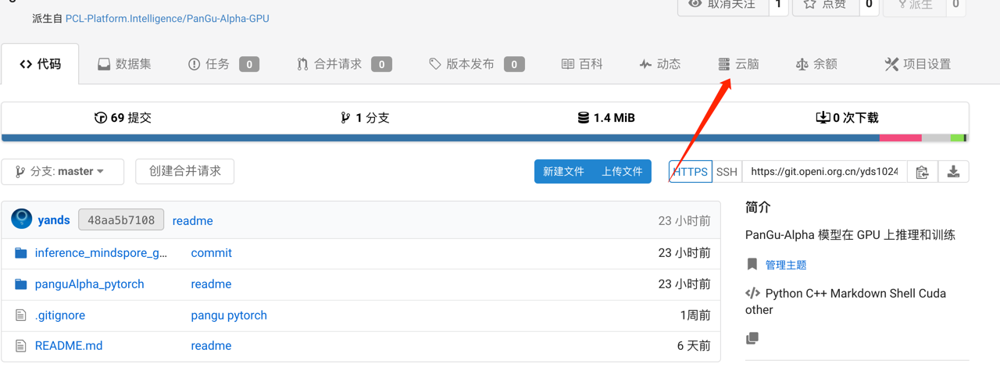
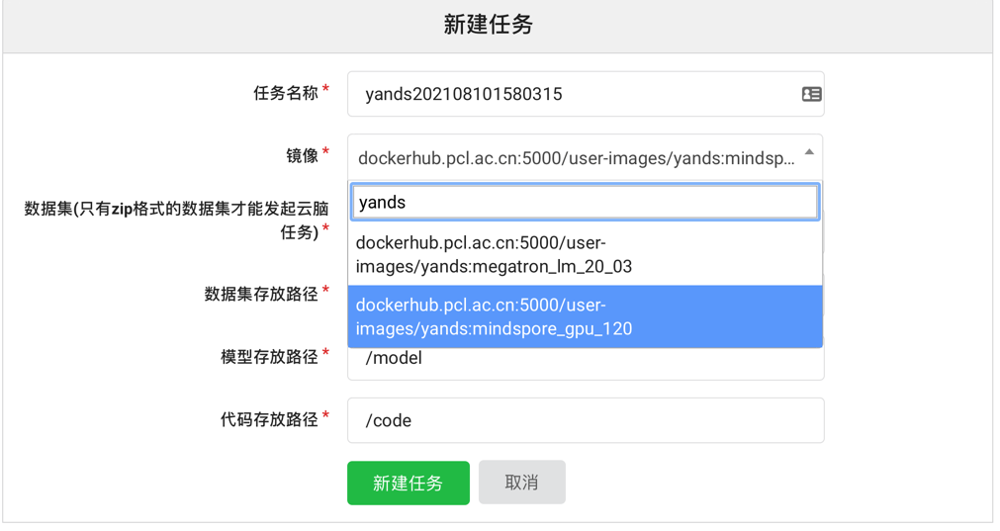
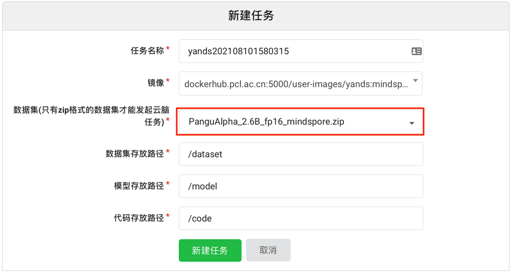

3 minutes inference tutorial for PanGu-α model

You can apply for a T4 GPU on the Cloud Brain page under the project in the OpenI community.

# 1、Register for OpenI Community
This step is not detailed, it's simple. Sight in OpenI community.

# 2、Fork PanGu-Alpha-GPU
If you want to apply for a GPU in the OpenI community you have to own a project first, and then apply for T4 inside the project. So you need to make [PanGu-Alpha-GPU](https://git.openi.org.cn/PCL-Platform.Intelligence/PanGu-Alpha-GPU)
as your personal project.

Go to the [PanGu-Alpha-GPU](https://git.openi.org.cn/PCL-Platform.Intelligence/PanGu-Alpha-GPU) project and click the `derive` button in the upper right corner to derive your own project based on the original one.

# 3. Apply GPU

- Click `云脑` in the project



- Click`新建任务`

- Search for the following image in the `镜像` section



- Select 'PanguAlpha_2.6B_fp16_mindspore.zip' in the `数据集存放路径` field


- Select a server with memory greater than or equal to 32g
  
- Click`新建任务`

- Wait a while and the `调试` button will appear, click inside you will see the familiar jupyter debugging interface

# 4、推理
- Directory structure

  /dataset/   where the dataset is stored, we put the model in this directory when we just submitted the task

  /code/      where the code of your project will be copied to this directory

  /model/     where the model is stored, you can download the files in this directory via `model download` in the task submission screen

- Go to the /code/inference_mindspore_gpu directory

- Run the inference script

```bash
python run_inference.py --model=2B6_fp16 --load_ckpt_path=/dataset/PanguAlpha_2.6B_fp16.ckpt
```

Congratulations, you have completed the inference process